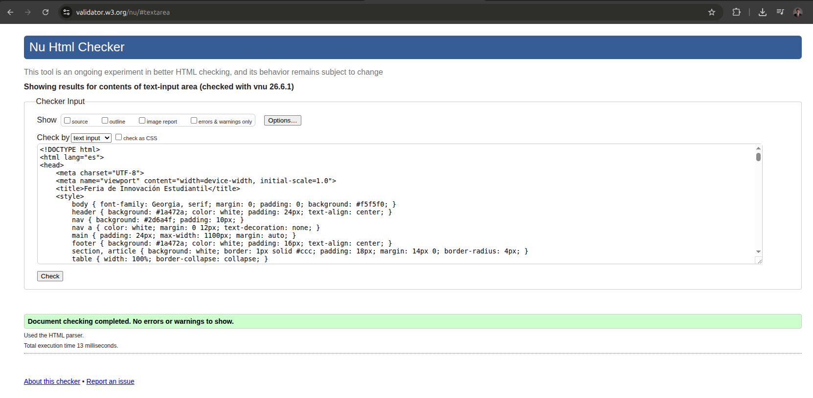

# Informe Final Unificado — Laboratorio HTML5 Avanzado

**Curso:** ISW-521 Programación en Ambiente Web I
**Tema:** HTML5 Avanzado — Auditoría y Refactorización de Código
**Sitio trabajado:** Feria Nacional de Innovación Estudiantil 2025
**Archivo original:** `v1_base_feria_innovacion.html`
**Archivo final validado:** `v2_feria_refactorizado.html`
**Evidencia de validación:** `captura_w3c.png` 

---

## Resumen general

Este informe unifica las tres fases del laboratorio. Primero se documentó la auditoría técnica del archivo HTML original, identificando problemas de semántica, accesibilidad, estructura, multimedia, seguridad y anidamiento. Luego se construyó un prompt técnico para refactorizar el documento con criterios específicos de HTML5 moderno. Finalmente, se revisó el resultado con el Validador W3C y con inspección manual del DOM, hasta obtener un archivo final sin errores ni advertencias.

La versión final corrige el problema de `Div-Soup`, incorpora etiquetas semánticas como `<header>`, `<nav>`, `<main>`, `<section>`, `<article>` y `<footer>`, mejora el formulario con `<label>`, `<fieldset>` y `<legend>`, estructura correctamente la tabla, corrige el video y asegura mejor el iframe del mapa.

---

## Tabla de contenidos

1. [Fase 1 — Reporte Técnico de Auditoría HTML5](#fase-1--reporte-técnico-de-auditoría-html5)
2. [Fase 2 — Ingeniería de Prompts para Refactorización HTML5](#fase-2--ingeniería-de-prompts-para-refactorización-html5)
3. [Fase 3 — Revisión Final del DOM](#fase-3--revisión-final-del-dom)
4. [Apéndice A — Código HTML final validado](#apéndice-a--código-html-final-validado)

---

# Fase 1 — Reporte Técnico de Auditoría HTML5

**Curso:** ISW-521 Programación en Ambiente Web I 
**Tema:** HTML5 Avanzado — Auditoría y Refactorización de Código 
**Archivo auditado:** `v1_base_feria_innovacion.html` 
**Sitio:** Feria Nacional de Innovación Estudiantil 2025 

---

## 1. Objetivo del reporte

El objetivo de esta auditoría es identificar, clasificar y documentar los principales problemas técnicos presentes en el archivo `v1_base_feria_innovacion.html`.

El código funciona visualmente en un navegador, pero presenta varios errores de estructura HTML5, semántica, accesibilidad, rendimiento, seguridad y mantenimiento. Esto significa que aunque la página “se ve”, internamente no está construida de una forma profesional ni fácil de escalar.

---

# 1.1 — Análisis del problema “Div-Soup”

## 1.1.1 Etiquetas HTML5 semánticas ausentes

En el archivo original se observa un uso excesivo de `<div>` para construir toda la estructura principal del documento.

Las etiquetas semánticas HTML5 que están completamente ausentes son:

- `<header>`
- `<main>`
- `<nav>`
- `<footer>`
- `<section>`
- `<article>`
- `<aside>`

Estas etiquetas deberían usarse para definir partes claras del documento. Por ejemplo:

- `<header>` para el encabezado principal.
- `<nav>` para el menú de navegación.
- `<main>` para el contenido principal.
- `<section>` para dividir bloques temáticos.
- `<article>` para contenido independiente, como cada proyecto finalista.
- `<footer>` para el pie de página.
- `<aside>` para contenido complementario, si existiera.

### Evidencia en el código original

```html
<div class="encabezado">
    <div>
        <div>
            <h1>Feria Nacional de Innovación Estudiantil 2025</h1>
            <div>ITCR Campus Cartago · 22, 23 y 24 de Octubre 2025</div>
            <div>Creando soluciones para los retos del mañana</div>
        </div>
    </div>
</div>

<div class="menu">
    <a href="#inicio">Inicio</a>
    <a href="#proyectos">Proyectos</a>
    <a href="#agenda">Agenda</a>
    <a href="#inscripcion">Inscripción</a>
    <a href="#sede">Sede</a>
</div>

<div class="contenido">
    ...
</div>

<div class="pie">
    ...
</div>
```

El problema es que estas partes sí tienen significado estructural, pero el código las trata como simples contenedores genéricos.

---

## 1.1.2 Problema del uso excesivo de `<div>` para SEO y estructura

El uso excesivo de `<div>` afecta negativamente la comprensión estructural del documento.

Un `<div>` no comunica significado por sí solo. Para el navegador, los motores de búsqueda y las tecnologías de asistencia, un `<div>` solamente indica que hay una división genérica. No dice si ese bloque es un encabezado, una navegación, una sección principal, un artículo o un pie de página.

Desde el punto de vista SEO, esto dificulta que los motores de búsqueda entiendan la jerarquía real del contenido. Google y otros buscadores pueden leer el texto, pero no reciben señales semánticas claras sobre qué parte del documento es más importante o qué función cumple cada sección.

Ejemplo problemático:

```html
<div class="menu">
    <a href="#inicio">Inicio</a>
    <a href="#proyectos">Proyectos</a>
    <a href="#agenda">Agenda</a>
</div>
```

Aunque visualmente funciona como menú, técnicamente debería ser:

```html
<nav>
    ...
</nav>
```

La etiqueta `<nav>` comunica explícitamente que ese bloque contiene navegación principal.

---

## 1.1.3 Qué es “Div-Soup” y su impacto real

“Div-Soup” significa una estructura HTML construida casi totalmente con `<div>`, sin usar etiquetas semánticas adecuadas.

En el archivo auditado, esto se observa porque casi todas las partes importantes de la página se construyen con `<div>`:

```html
<div id="inicio" class="tarjeta">
    <h2>Acerca de la Feria</h2>
    <div>
        <p>...</p>
    </div>
</div>
```

```html
<div id="proyectos" class="tarjeta">
    <h2>Proyectos Finalistas</h2>
    <div>
        <div class="tarjeta">
            ...
        </div>
    </div>
</div>
```

El impacto real en un proyecto profesional es alto:

1. **Mantenimiento más difícil:** otros desarrolladores deben adivinar qué representa cada `<div>`.
2. **Escalabilidad limitada:** al crecer el sitio, la estructura se vuelve confusa.
3. **Menor accesibilidad:** lectores de pantalla y herramientas de asistencia tienen menos información para navegar.
4. **Menor calidad técnica:** el documento pierde claridad semántica.
5. **Mayor riesgo de errores:** cambiar una parte puede afectar otra porque no hay una jerarquía clara.

---

# 1.2 — Análisis del Formulario de Inscripción

## 1.2.1 Uso incorrecto o ausente de `<label>`

En el formulario no se usan etiquetas `<label>` correctamente vinculadas a los campos mediante `for` e `id`.

En lugar de usar `<label>`, el código usa `<div>` como texto descriptivo:

```html
<div>Nombre del equipo o proyecto:</div>
<input type="text" placeholder="Nombre oficial del proyecto">

<div>Nombre del responsable principal:</div>
<input type="text" placeholder="Nombre y apellidos completos">

<div>Correo de contacto:</div>
<input type="text" placeholder="correo@institucion.ac.cr">

<div>Número de teléfono:</div>
<input type="text" placeholder="XXXX-XXXX">
```

Esto es un problema porque el navegador no puede asociar formalmente el texto con su campo correspondiente.

La forma correcta sería algo similar a:

```html
<label for="nombre-equipo">Nombre del equipo o proyecto:</label>
<input id="nombre-equipo" name="nombre-equipo" type="text">
```

### Impacto para el usuario final

La ausencia de `<label>` afecta especialmente la accesibilidad y la experiencia de usuario:

- Un lector de pantalla puede no identificar claramente qué debe escribir el usuario en cada campo.
- Al hacer clic sobre el texto, el campo no se activa.
- El formulario es más difícil de usar para personas con discapacidad visual o motora.
- Se depende demasiado del `placeholder`, pero el `placeholder` desaparece cuando el usuario escribe.

Además, varios campos tienen `type="text"` aunque deberían usar tipos más específicos:

```html
<input type="text" placeholder="correo@institucion.ac.cr">
<input type="text" placeholder="XXXX-XXXX">
```

El correo debería usar `type="email"` y el teléfono podría usar `type="tel"`.

---

## 1.2.2 Elementos semánticos para agrupar datos

El formulario no agrupa los datos por bloques lógicos. Todo está colocado en una misma secuencia de campos.

El elemento semántico correcto para agrupar datos relacionados es:

```html
<fieldset>
```

La etiqueta que describe el propósito de cada grupo es:

```html
<legend>
```

Para este formulario deberían existir al menos dos grupos:

1. **Datos del equipo o responsable**
2. **Detalles del proyecto**

Ejemplo de estructura recomendada:

```html
<fieldset>
    <legend>Datos del equipo</legend>
    ...
</fieldset>

<fieldset>
    <legend>Detalles del proyecto</legend>
    ...
</fieldset>
```

Esto mejora la comprensión del formulario y permite que el usuario entienda mejor qué información está completando.

---

## 1.2.3 Análisis del campo “Carrera o programa académico”

El campo “Carrera o programa académico” usa actualmente un `<select>`:

```html
<div>Carrera o programa académico:</div>
<select>
    <option>Seleccione su carrera</option>
    <option>Ingeniería en Computación</option>
    <option>Ingeniería Eléctrica</option>
    <option>Ingeniería Ambiental</option>
    <option>Biotecnología</option>
    <option>Diseño Industrial</option>
    <option>Administración de Empresas</option>
    <option>Agronomía</option>
    <option>Arquitectura</option>
    <option>Otra</option>
</select>
```

Un `<datalist>` sería técnicamente superior en este caso porque permite sugerir opciones sin obligar al usuario a elegir solamente una de ellas.

La diferencia funcional es:

- `<select>`: el usuario debe escoger una opción cerrada de una lista.
- `<datalist>`: el usuario puede escribir libremente, pero recibe sugerencias disponibles.

Para “Carrera o programa académico”, esto tiene más sentido porque pueden existir muchas carreras o programas que no estén en la lista.

Ejemplo recomendado:

```html
<label for="carrera">Carrera o programa académico:</label>
<input id="carrera" name="carrera" list="lista-carreras">

<datalist id="lista-carreras">
    <option value="Ingeniería en Computación">
    <option value="Ingeniería Eléctrica">
    <option value="Ingeniería Ambiental">
    <option value="Biotecnología">
    <option value="Diseño Industrial">
    <option value="Administración de Empresas">
    <option value="Agronomía">
    <option value="Arquitectura">
</datalist>
```

---

# 1.3 — Análisis de la Tabla de Agenda

## 1.3.1 Secciones estructurales ausentes

La tabla de agenda no tiene las secciones estructurales recomendadas:

- `<caption>`
- `<thead>`
- `<tbody>`
- `<tfoot>`

### Evidencia en el código original

```html
<table>
    <tr>
        <th>Hora</th>
        <th>Miércoles 22 Oct</th>
        <th>Jueves 23 Oct</th>
        <th>Viernes 24 Oct</th>
    </tr>
    <tr>
        <td>7:30 - 8:30</td>
        <td>Registro y acreditación</td>
        <td>Apertura de sala</td>
        <td>Apertura de sala</td>
    </tr>
    ...
    <tr>
        <td><strong>Total horas</strong></td>
        <td><strong>9 horas</strong></td>
        <td><strong>9 horas</strong></td>
        <td><strong>7 horas</strong></td>
    </tr>
</table>
```

La tabla funciona visualmente, pero está incompleta semánticamente.

---

## 1.3.2 Por qué `<thead>`, `<tbody>` y `<tfoot>` son funcionales

Estas etiquetas no son meramente estéticas. Ayudan a dividir la tabla según su función:

- `<thead>`: contiene los encabezados de columnas.
- `<tbody>`: contiene los datos principales.
- `<tfoot>`: contiene totales, resúmenes o conclusiones.

En esta tabla, la primera fila debería estar dentro de `<thead>`, las actividades deberían estar dentro de `<tbody>` y la fila de total de horas debería estar dentro de `<tfoot>`.

Esto ayuda a:

- Lectores de pantalla.
- Navegadores.
- Herramientas de análisis.
- Exportación o procesamiento de datos.
- Mantenimiento del código.

---

## 1.3.3 Falta del atributo `scope` en los encabezados `<th>`

Los encabezados de la tabla usan `<th>`, pero no tienen el atributo `scope`.

Código actual:

```html
<th>Hora</th>
<th>Miércoles 22 Oct</th>
<th>Jueves 23 Oct</th>
<th>Viernes 24 Oct</th>
```

Como estos encabezados describen columnas, deberían usar:

```html
<th scope="col">Hora</th>
<th scope="col">Miércoles 22 Oct</th>
<th scope="col">Jueves 23 Oct</th>
<th scope="col">Viernes 24 Oct</th>
```

Además, las horas de cada fila podrían marcarse como encabezados de fila usando `scope="row"`:

```html
<th scope="row">7:30 - 8:30</th>
```

El valor `colgroup` no sería necesario en esta tabla, porque no hay grupos de columnas definidos mediante `<colgroup>`.

### Impacto de omitir `scope`

Sin `scope`, las tecnologías de asistencia tienen menos información para relacionar cada celda con su encabezado. Esto puede causar que una persona usando lector de pantalla no entienda correctamente a qué día corresponde una actividad.

---

## 1.3.4 Ausencia de `<caption>`

No hay un elemento `<caption>` presente en la tabla.

El `<caption>` sirve para describir el propósito de la tabla. En este caso, podría ser:

```html
<caption>Agenda oficial de actividades de la Feria Nacional de Innovación Estudiantil 2025</caption>
```

Esto es importante porque el usuario entiende rápidamente qué representa la tabla antes de leer sus filas y columnas. También mejora la accesibilidad porque los lectores de pantalla pueden anunciar el propósito de la tabla.

---

# 1.4 — Análisis del Elemento Video

## 1.4.1 Atributo faltante para imagen previa

El video no tiene el atributo `poster`.

Código actual:

```html
<video width="100%">
    <source src="video/feria_presentacion.mp4" type="video/mp4">
</video>
```

El atributo que falta es:

```html
poster="img/feria-poster.jpg"
```

El `poster` permite mostrar una imagen previa antes de que el usuario reproduzca el video.

### Impacto en CLS y Core Web Vitals

La falta de `poster` puede afectar la experiencia visual porque el video puede aparecer como un bloque vacío o cargar de forma inestable. Si no se reservan correctamente dimensiones y contenido visual, puede generar movimientos inesperados en la página.

Esto se relaciona con el Cumulative Layout Shift (CLS), una métrica de Core Web Vitals que mide los cambios inesperados en el layout mientras carga la página.

Aunque el video tiene `width="100%"`, no tiene una imagen previa ni una proporción visual clara mediante `height` o CSS moderno como `aspect-ratio`. Esto puede afectar la estabilidad visual de la página.

---

## 1.4.2 Problema de tener un solo `<source>`

El video tiene únicamente una fuente en formato MP4:

```html
<source src="video/feria_presentacion.mp4" type="video/mp4">
```

Esto es limitado porque no todos los navegadores o contextos soportan los mismos formatos con la misma eficiencia.

Para mayor compatibilidad cruzada, deberían agregarse al menos dos formatos:

```html
<source src="video/feria_presentacion.mp4" type="video/mp4">
<source src="video/feria_presentacion.webm" type="video/webm">
```

Formatos recomendados:

- `video/mp4`
- `video/webm`

Opcionalmente también podría considerarse `video/ogg`, aunque hoy en día MP4 y WebM suelen ser los más comunes.

---

## 1.4.3 Falta del atributo `controls`

El video no tiene el atributo `controls`.

Código actual:

```html
<video width="100%">
```

Debería ser:

```html
<video width="100%" controls>
```

Sin `controls`, el usuario no tiene botones nativos para reproducir, pausar, cambiar volumen o avanzar en el video.

Esto representa un problema de usabilidad porque el contenido multimedia queda presente, pero no se puede controlar fácilmente.

---

# 1.5 — Análisis del iFrame del Mapa

## 1.5.1 Falta del atributo de rendimiento `loading`

El `<iframe>` de Google Maps no tiene el atributo `loading`.

Código actual:

```html
<iframe
    src="https://www.google.com/maps/embed?pb=..."
    width="100%"
    height="420"
    style="border:0;"
    allowfullscreen="">
</iframe>
```

El atributo recomendado es:

```html
loading="lazy"
```

Este atributo hace que el mapa no cargue inmediatamente al abrir la página, sino hasta que el usuario se acerque a esa parte del documento.

Esto mejora el rendimiento inicial, porque los mapas embebidos suelen ser pesados y pueden retrasar la carga de la página.

---

## 1.5.2 Falta del atributo de seguridad `sandbox`

El iframe tampoco tiene el atributo `sandbox`.

El atributo faltante es:

```html
sandbox
```

Este atributo limita lo que el contenido embebido puede hacer dentro de la página.

Una configuración posible para un mapa embebido podría ser:

```html
sandbox="allow-scripts allow-same-origin"
```

Sin embargo, debe usarse con cuidado, porque mientras más permisos se agreguen, menor es el aislamiento.

Al menos tres restricciones importantes que deberían mantenerse activas, salvo necesidad real, son:

1. No permitir formularios embebidos con `allow-forms`.
2. No permitir ventanas emergentes con `allow-popups`.
3. No permitir navegación superior con `allow-top-navigation`.

El problema del código actual es que el iframe queda sin una política explícita de aislamiento. Esto puede representar un riesgo, especialmente cuando se incrusta contenido externo.

---

## 1.5.3 Falta del atributo `title`

El iframe no tiene atributo `title`.

Código actual:

```html
<iframe
    src="https://www.google.com/maps/embed?pb=..."
    width="100%"
    height="420"
    style="border:0;"
    allowfullscreen="">
</iframe>
```

Debería incluir algo como:

```html
title="Mapa de ubicación del ITCR Campus Central Cartago"
```

El `title` es necesario porque ayuda a identificar el propósito del contenido embebido. Para usuarios con lector de pantalla, un iframe sin título puede resultar confuso porque no se comunica claramente qué contiene.

---

# 1.6 — Análisis del Anidamiento Incorrecto

## 1.6.1 Instancias donde un elemento de bloque está anidado dentro de un elemento de línea

En el código original existen errores de anidamiento donde elementos de bloque aparecen dentro de elementos de línea.

### Caso 1: `<div>` y `<h3>` dentro de `<span>`

```html
<span>
    <div>
        <h3>Secretaría de la Feria</h3>
        <div>feria.innovacion@itcr.ac.cr</div>
        <div>Teléfono: 2550-9000 ext. 3100</div>
    </div>
</span>
```

Este caso es problemático porque `<span>` es un elemento de línea pensado para contenido de frase, no para contener bloques como `<div>` o encabezados como `<h3>`.

Una mejor estructura sería:

```html
<section>
    <h3>Secretaría de la Feria</h3>
    <p>feria.innovacion@itcr.ac.cr</p>
    <p>Teléfono: 2550-9000 ext. 3100</p>
</section>
```

---

### Caso 2: `<div>` dentro de `<a>`

```html
<a href="https://www.tec.ac.cr">
    <div>
        <div>Portal oficial del ITCR</div>
        <div>www.tec.ac.cr · Campus Cartago</div>
    </div>
</a>
```

Este caso es riesgoso dentro del contexto del laboratorio porque se está usando un enlace como contenedor de bloques completos.

Nota técnica: en HTML5, un `<a>` puede envolver cierto contenido de flujo si no contiene elementos interactivos dentro. Aun así, para este ejercicio, la estructura es poco clara y conviene evitar usar el enlace como contenedor genérico. Una alternativa más limpia sería colocar el enlace dentro de un párrafo o dentro de una tarjeta estructurada correctamente.

Ejemplo recomendado:

```html
<p>
    <a href="https://www.tec.ac.cr">Portal oficial del ITCR</a>
</p>
<p>www.tec.ac.cr · Campus Cartago</p>
```

---

## 1.6.2 Por qué el navegador intenta corregir estos errores

Los navegadores intentan construir un DOM válido incluso cuando el HTML tiene errores. Por eso, al encontrar un anidamiento incorrecto, el navegador puede cerrar etiquetas automáticamente, mover nodos o reorganizar partes del árbol del documento.

Esto puede provocar que el DOM final no sea exactamente igual al código escrito.

El problema es que esa “corrección automática” puede romper el layout de maneras impredecibles. Por ejemplo:

- Un elemento puede terminar fuera del contenedor esperado.
- Un estilo CSS puede dejar de aplicarse correctamente.
- Una sección puede cambiar de jerarquía.
- Un lector de pantalla puede interpretar la estructura de forma diferente.
- El comportamiento de enlaces o bloques clicables puede ser inconsistente.

En proyectos profesionales esto es peligroso porque el error puede no verse inmediatamente, pero puede aparecer al cambiar CSS, agregar scripts o probar en otro navegador.

---

## 1.6.3 Cómo verificar este tipo de error con DevTools

Para verificar errores de anidamiento con DevTools se puede seguir este procedimiento:

1. Abrir el archivo `v1_base_feria_innovacion.html` en Google Chrome o Microsoft Edge.
2. Presionar `F12` o clic derecho y elegir “Inspeccionar”.
3. Ir a la pestaña **Elements**.
4. Buscar la sección de contacto.
5. Comparar el código fuente original con el árbol DOM que muestra DevTools.
6. Revisar si el navegador movió, cerró o reorganizó etiquetas automáticamente.
7. Expandir los nodos `<span>` y `<a>` para verificar si contienen elementos que no deberían.
8. Usar también el validador W3C para confirmar errores estructurales.

La clave es no revisar solamente el archivo fuente, sino también el DOM final interpretado por el navegador.

---

# 2. Resumen de hallazgos

| Área auditada | Problema encontrado | Impacto |
|---|---|---|
| Estructura general | Uso excesivo de `<div>` | Baja semántica, peor mantenimiento y menor claridad |
| Semántica HTML5 | Ausencia de `<header>`, `<main>`, `<nav>`, `<footer>`, `<section>`, `<article>`, `<aside>` | Documento poco estructurado |
| Formulario | No hay `<label>` con `for` e `id` | Problemas de accesibilidad y usabilidad |
| Formulario | No hay `<fieldset>` ni `<legend>` | Campos sin agrupación lógica |
| Campo de carrera | Uso de `<select>` en vez de `<datalist>` | Menor flexibilidad para el usuario |
| Tabla | No hay `<caption>`, `<thead>`, `<tbody>`, `<tfoot>` | Tabla menos accesible y menos funcional |
| Tabla | `<th>` sin `scope` | Relación débil entre encabezados y celdas |
| Video | Falta `poster` | Peor experiencia visual y posible impacto en CLS |
| Video | Falta `controls` | El usuario no puede controlar la reproducción |
| Video | Solo existe un formato fuente | Menor compatibilidad entre navegadores |
| Iframe | Falta `loading="lazy"` | Carga inicial más pesada |
| Iframe | Falta `sandbox` | Menor aislamiento de seguridad |
| Iframe | Falta `title` | Problema de accesibilidad |
| Anidamiento | Bloques dentro de elementos de línea | DOM impredecible y posible ruptura del layout |

---

# 3. Conclusión de la auditoría

El archivo `v1_base_feria_innovacion.html` presenta una estructura visualmente funcional, pero técnicamente deficiente. El principal problema es el uso excesivo de `<div>` como contenedor universal, lo que produce un caso claro de “Div-Soup”.

Además, el formulario carece de etiquetas accesibles, la tabla no está estructurada correctamente, el video no ofrece controles ni compatibilidad suficiente, el iframe no tiene atributos importantes de rendimiento, seguridad y accesibilidad, y existen errores de anidamiento que pueden afectar la interpretación del DOM.

La página debe refactorizarse usando HTML5 semántico, formularios accesibles, tablas estructuradas, multimedia controlable y contenido embebido con mejores prácticas de rendimiento y seguridad.

En resumen, el código necesita una refactorización completa para pasar de una página que solo “se ve bien” a una página correctamente construida, mantenible, accesible y alineada con estándares modernos de HTML5.

---

# 4. Recomendaciones principales para la siguiente fase

Para la Fase 2, el prompt de refactorización debería exigir como mínimo:

1. Reemplazar `<div>` estructurales por etiquetas semánticas.
2. Usar `<header>`, `<nav>`, `<main>` y `<footer>`.
3. Convertir cada bloque principal en `<section>`.
4. Convertir cada proyecto finalista en `<article>`.
5. Agregar `<label for="">` e `id` a todos los campos del formulario.
6. Agrupar el formulario con `<fieldset>` y `<legend>`.
7. Cambiar el campo de carrera a `<input list="">` con `<datalist>`.
8. Estructurar la tabla con `<caption>`, `<thead>`, `<tbody>` y `<tfoot>`.
9. Agregar `scope` a todos los encabezados `<th>`.
10. Agregar `poster`, `controls` y fuentes alternativas al video.
11. Agregar `loading="lazy"`, `sandbox` y `title` al iframe.
12. Corregir todo anidamiento incorrecto de elementos.

---

# Fase 2 — Ingeniería de Prompts para Refactorización HTML5

## 1. Datos generales

**Curso:** ISW-521 Programación en Ambiente Web I 
**Laboratorio:** HTML5 Avanzado — Auditoría y Refactorización de Código 
**Archivo original analizado:** `v1_base_feria_innovacion.html` 
**Archivo generado por la IA:** `v2_feria_refactorizado_ia.html` 
**Objetivo de esta fase:** construir un prompt técnico de alta precisión para que una IA refactorice correctamente el código HTML deficiente, aplicando HTML5 semántico, accesibilidad básica, estructura correcta de formularios, tabla bien formada, video completo, iframe más seguro y corrección del anidamiento inválido.

---

## 2. Prompt técnico construido

### Sección A — Rol y contexto

Actúa como un Desarrollador Frontend Senior especializado en HTML5 semántico, accesibilidad web básica, estándares W3C, estructura correcta del DOM y buenas prácticas de mantenimiento en sitios institucionales.

Vas a recibir el código HTML completo de un sitio web llamado **Feria Nacional de Innovación Estudiantil 2025**. El código fue generado de forma deficiente y debe ser refactorizado sin cambiar el contenido principal del sitio.

Tu tarea es devolver una versión corregida, moderna y semánticamente válida del documento HTML.

### Sección B — Descripción del problema

El archivo recibido presenta varios problemas técnicos:

- Uso excesivo de `<div>` para construir toda la estructura del documento, generando un problema de tipo **Div-Soup**.
- Ausencia de etiquetas HTML5 semánticas como `<header>`, `<nav>`, `<main>`, `<section>`, `<article>` y `<footer>`.
- Formulario de inscripción sin etiquetas `<label>` correctamente vinculadas con `for` e `id`.
- Campos del formulario sin agrupación semántica mediante `<fieldset>` y `<legend>`.
- Campo “Carrera o programa académico” construido con `<select>`, aunque debería permitir escribir o seleccionar opciones mediante `<input list="...">` y `<datalist>`.
- Tabla de agenda sin `<caption>`, `<thead>`, `<tbody>`, `<tfoot>` ni atributos `scope` en sus encabezados.
- Elemento `<video>` sin `controls`, sin `poster` y con una sola fuente de video.
- `<iframe>` de Google Maps sin `loading="lazy"`, sin `sandbox` y sin `title` descriptivo.
- Errores de anidamiento donde elementos de bloque aparecen dentro de elementos de línea, especialmente `<div>` y `<h3>` dentro de `<span>`, y `<div>` dentro de `<a>`.

### Sección C — Restricciones técnicas explícitas

DEBES cumplir todas estas reglas:

1. DEBES conservar el contenido textual principal del sitio original.
2. DEBES reemplazar los `<div>` estructurales por etiquetas semánticas HTML5 correctas: `<header>`, `<nav>`, `<main>`, `<section>`, `<article>` y `<footer>`.
3. DEBES dejar `<header>`, `<nav>`, `<main>` y `<footer>` como elementos principales dentro del `<body>`.
4. DEBES organizar el contenido principal en secciones claras mediante `<section>` y usar `<article>` para cada proyecto finalista.
5. DEBES usar `<h1>` solo para el título principal del sitio y mantener una jerarquía lógica con `<h2>` y `<h3>`.
6. DEBES corregir el formulario para que todos los campos tengan `<label>` asociado con `for`, y que cada campo tenga un `id` coincidente.
7. DEBES agrupar los campos del formulario usando `<fieldset>` y `<legend>`, creando al menos estos grupos: datos del equipo, detalles del proyecto y confirmaciones.
8. DEBES cambiar el campo “Carrera o programa académico” de `<select>` a `<input>` vinculado a un `<datalist>` con las mismas opciones.
9. DEBES mantener `<select>` solo donde sea más adecuado, por ejemplo para institución y categoría de participación.
10. DEBES corregir la tabla de agenda agregando `<caption>`, `<thead>`, `<tbody>` y `<tfoot>`.
11. DEBES agregar `scope="col"` a los encabezados superiores de la tabla y `scope="row"` a los encabezados de cada fila cuando corresponda.
12. DEBES mover la fila de totales de horas al `<tfoot>`.
13. DEBES corregir el elemento `<video>` agregando `controls`, `poster` y al menos dos elementos `<source>` con tipos `video/mp4` y `video/webm`.
14. DEBES agregar texto alternativo dentro de `<video>` para navegadores que no soporten video HTML5.
15. DEBES corregir el `<iframe>` agregando `loading="lazy"`, un atributo `sandbox` con permisos limitados y un `title` descriptivo.
16. DEBES evitar anidar elementos de bloque dentro de elementos de línea.
17. DEBES eliminar los casos de `<div>` dentro de `<span>` y `<div>` dentro de `<a>`.
18. DEBES usar `<address>` para los datos de contacto de la feria.
19. DEBES agregar `lang="es"` al elemento `<html>`.
20. DEBES agregar `<meta name="viewport" content="width=device-width, initial-scale=1.0">` en el `<head>`.
21. DEBES conservar un CSS simple dentro del mismo documento, sin usar archivos externos.
22. NO DEBES agregar JavaScript.
23. NO DEBES cambiar el tema visual general del sitio.
24. NO DEBES entregar explicaciones fuera del código final.

### Sección D — Criterios de validación

Antes de responder, verifica manualmente lo siguiente:

1. El documento usa `<!DOCTYPE html>` y `<html lang="es">`.
2. El `<body>` contiene estructura semántica principal: `<header>`, `<nav>`, `<main>` y `<footer>`.
3. No quedan `<div>` usados como estructura principal.
4. Los proyectos finalistas están representados como `<article>`.
5. Todos los campos del formulario tienen `<label for="...">` y un campo con `id` correspondiente.
6. El formulario tiene al menos dos grupos `<fieldset>` con `<legend>` descriptivo.
7. El campo carrera usa `<input list="...">` y `<datalist>`, no `<select>`.
8. La tabla contiene `<caption>`, `<thead>`, `<tbody>` y `<tfoot>`.
9. Todos los `<th>` tienen `scope="col"` o `scope="row"` según corresponda.
10. El `<video>` incluye `controls`, `poster`, un `<source>` MP4 y un `<source>` WebM.
11. El `<iframe>` incluye `loading="lazy"`, `sandbox` y `title`.
12. No existe ningún `<div>`, `<p>` ni `<h1>`-`<h6>` dentro de `<span>` o `<a>`.
13. La jerarquía de encabezados es lógica.
14. El documento puede pegarse en el Validador W3C para revisión.

### Sección E — Formato del resultado

Devuelve únicamente el código HTML completo y corregido, sin explicaciones, sin comentarios adicionales y sin texto antes o después del bloque de código. El resultado debe estar listo para guardarse como:

`v2_feria_refactorizado_ia.html`

---

## 3. Iteración documentada

### Primer intento

El prompt se construyó de forma específica incluyendo rol, contexto, descripción del problema, restricciones técnicas, criterios de validación y formato final esperado.

### Resultado de la iteración

El resultado fue satisfactorio porque el HTML generado:

- Sustituye la estructura basada en `<div>` por etiquetas semánticas.
- Corrige el formulario con `<label>`, `id`, `<fieldset>` y `<legend>`.
- Cambia el campo de carrera a `<input>` con `<datalist>`.
- Corrige la tabla con `<caption>`, `<thead>`, `<tbody>`, `<tfoot>` y `scope`.
- Agrega `controls`, `poster` y fuentes alternativas al video.
- Agrega `loading="lazy"`, `sandbox` y `title` al iframe.
- Elimina el anidamiento inválido de bloques dentro de elementos de línea.

No fue necesario realizar una segunda iteración del prompt porque el resultado cumplió los criterios principales de la Fase II.

---

## 4. Código HTML resultante

El código HTML generado inicialmente fue revisado posteriormente con el Validador W3C. Durante la Fase III se aplicaron ajustes puntuales para dejar el documento sin errores ni advertencias:

- Se agregó una opción vacía y seleccionada en el `<select required>` de categoría.
- Se ajustó el atributo `sandbox` del `<iframe>` para evitar la advertencia de W3C.
- Se mantuvieron los atributos `loading="lazy"` y `title` en el mapa embebido.

El código final validado se incluye completo en el **Apéndice A — Código HTML final validado** de este informe.

# Fase 3 — Revisión Final del DOM

**Curso:** ISW-521 Programación en Ambiente Web I 
**Laboratorio:** HTML5 Avanzado — Auditoría y Refactorización de Código 
**Archivo revisado:** `v2_feria_refactorizado.html` 
**Archivo original:** `v1_base_feria_innovacion.html` 
**Evidencia:** captura del Validador W3C adjunta como archivo aparte.

---

## 3.1 — Validación con el Validador W3C

Para validar el archivo final, se utilizó el validador oficial de W3C en la opción **Validate by Direct Input**. Se copió el contenido completo del archivo `v2_feria_refactorizado.html`, se pegó en el área de texto del validador y se ejecutó la revisión con el botón **Check**.

Después de revisar el resultado inicial, se corrigieron los mensajes reportados por el validador. Los ajustes aplicados fueron los siguientes:

1. En el `<select>` de **Categoría de participación**, se agregó una primera opción vacía para cumplir correctamente con el uso de `required`:

```html
<option value="" selected>Seleccione una categoría</option>
```

2. En el `<iframe>` del mapa, se ajustó el atributo `sandbox`, eliminando `allow-same-origin` para evitar la advertencia generada por la combinación de permisos demasiado amplia. El valor final usado fue:

```html
sandbox="allow-scripts allow-popups"
```

3. Se verificó que el `iframe` conservara los atributos necesarios de rendimiento, accesibilidad y seguridad:

```html
loading="lazy"
title="Mapa de ubicación del ITCR Campus Central Cartago"
sandbox="allow-scripts allow-popups"
```

Luego de aplicar estas correcciones, el documento fue validado nuevamente. La captura tomada del resultado final del Validador W3C se entrega como evidencia en un archivo aparte.

**Captura de validación:**



---

## 3.2 — Inspección del DOM con DevTools

La revisión manual del DOM se realizó abriendo el archivo `v2_feria_refactorizado.html` en el navegador y usando las DevTools con la tecla **F12**. En la pestaña **Elements**, se inspeccionó la estructura real que el navegador construyó a partir del HTML.

### Presencia de etiquetas principales

Se confirmó que la página usa correctamente las etiquetas principales de HTML5:

```html
<body>
    <header>...</header>
    <nav>...</nav>
    <main>...</main>
    <footer>...</footer>
</body>
```

Esto corrige el problema del archivo original, donde casi toda la estructura dependía de `<div>` con clases como `encabezado`, `menu`, `contenido`, `tarjeta` y `pie`.

### Organización del contenido principal

Dentro de `<main>`, el contenido quedó dividido en secciones claras:

- `section id="inicio"` para la información general de la feria.
- `section` para el video de presentación.
- `section id="proyectos"` para los proyectos finalistas.
- `section id="agenda"` para la agenda del evento.
- `section id="inscripcion"` para el formulario.
- `section id="sede"` para la ubicación.
- `section` para contacto y consultas.

Además, los proyectos finalistas fueron organizados con `<article>`, porque cada proyecto funciona como una unidad de contenido independiente dentro de la sección de proyectos.

### Revisión de anidamiento incorrecto

Se revisó que no existieran elementos de bloque colocados dentro de elementos de línea. En el archivo original sí existían problemas como:

```html
<span>
    <div>
        <h3>Secretaría de la Feria</h3>
    </div>
</span>
```

Y también:

```html
<a href="https://www.tec.ac.cr">
    <div>
        <div>Portal oficial del ITCR</div>
        <div>www.tec.ac.cr · Campus Cartago</div>
    </div>
</a>
```

En la versión corregida, estas estructuras fueron reemplazadas por elementos válidos. La sección de contacto usa `<article>`, `<address>`, `<p>` y enlaces correctamente ubicados. No se encontraron `<div>`, `<p>` ni encabezados `<h1>` a `<h6>` como hijos directos de un `<span>`.

### Revisión del formulario

El formulario fue inspeccionado en el DOM y se comprobó que los campos están agrupados con `<fieldset>` y `<legend>`:

```html
<fieldset>
    <legend>Datos del equipo</legend>
</fieldset>

<fieldset>
    <legend>Detalles del proyecto</legend>
</fieldset>

<fieldset>
    <legend>Confirmaciones</legend>
</fieldset>
```

También se confirmó que cada `<label>` utiliza el atributo `for` vinculado al `id` del campo correspondiente. Esto mejora la accesibilidad y permite que el usuario pueda activar el campo al hacer clic sobre el texto de la etiqueta.

El campo **Carrera o programa académico** fue corregido para usar `input` con `datalist`, permitiendo escribir una opción personalizada o seleccionar una opción sugerida:

```html
<input id="carrera" name="carrera" type="text" list="lista-carreras">
<datalist id="lista-carreras">
    <option value="Ingeniería en Computación"></option>
    <option value="Ingeniería Eléctrica"></option>
    <option value="Ingeniería Ambiental"></option>
</datalist>
```

### Revisión de la tabla

La tabla de agenda fue inspeccionada y ahora tiene una estructura semántica completa:

```html
<table>
    <caption>Horario oficial de actividades...</caption>
    <thead>...</thead>
    <tbody>...</tbody>
    <tfoot>...</tfoot>
</table>
```

También se verificó que los encabezados principales usan `scope="col"` y los encabezados de hora usan `scope="row"`. Esto permite interpretar mejor la relación entre las horas, los días y las actividades.

### Revisión del video

El video ahora tiene los atributos y fuentes requeridas:

```html
<video controls poster="img/feria_poster.jpg">
    <source src="video/feria_presentacion.mp4" type="video/mp4">
    <source src="video/feria_presentacion.webm" type="video/webm">
</video>
```

Con esto se corrige la falta de controles, la ausencia de imagen previa y la falta de una segunda fuente para mejorar compatibilidad entre navegadores.

### Revisión del iframe

El mapa embebido fue corregido con atributos de rendimiento, seguridad y accesibilidad:

```html
<iframe
    loading="lazy"
    sandbox="allow-scripts allow-popups"
    title="Mapa de ubicación del ITCR Campus Central Cartago">
</iframe>
```

El atributo `loading="lazy"` evita que el mapa cargue de inmediato si el usuario todavía no ha llegado a esa sección. El atributo `sandbox` limita permisos del contenido embebido y el atributo `title` permite identificar el propósito del iframe.

---

## Comparación entre versión original y versión refactorizada

La versión original estaba construida principalmente con `<div>`, lo que hacía que la estructura fuera menos clara para el navegador, para lectores de pantalla y para otros desarrolladores. Aunque visualmente la página podía funcionar, el documento no expresaba bien qué parte era encabezado, navegación, contenido principal, secciones o pie de página.

En la versión refactorizada, la jerarquía del documento es más clara. El `<body>` contiene directamente `header`, `nav`, `main` y `footer`. El contenido principal está separado en `section` y los proyectos se representan con `article`. La tabla tiene estructura completa, el formulario está agrupado correctamente y los elementos multimedia tienen atributos más seguros y accesibles.

El cambio principal no fue solo visual, sino estructural. El HTML final comunica mejor la intención de cada parte de la página.

---

## 3.3 — Checklist de Verificación Final

- [x] La página usa `<header>`, `<nav>`, `<main>` y `<footer>` en lugar de `<div>` estructural.
- [x] El contenido principal se divide en `<section>` o `<article>` con semántica apropiada.
- [x] El formulario tiene al menos dos grupos `<fieldset>` con `<legend>` descriptivos.
- [x] Todos los `<label>` usan `for` vinculado al `id` de su campo correspondiente.
- [x] El campo de carrera usa `<input list="...">` + `<datalist>` y no un `<select>`.
- [x] El `<video>` tiene `poster`, `controls` y mínimo dos `<source>` con distinto `type`.
- [x] El `<iframe>` tiene `loading="lazy"`, `sandbox` con valores apropiados y `title`.
- [x] No hay elementos de bloque como `<div>`, `<p>` o encabezados dentro de `<span>`.
- [x] La tabla tiene `<caption>`, `<thead>`, `<tbody>`, `<tfoot>` y los `<th>` tienen `scope`.
- [x] La validación W3C fue revisada después de aplicar las correcciones finales.

---

## Reflexión final

Trabajar con IA para refactorizar código puede ahorrar bastante tiempo, pero esta práctica me dejó claro que no se debe confiar ciegamente en el primer resultado. La IA puede generar una estructura aparentemente correcta, pero todavía pueden quedar detalles que solo se detectan revisando con herramientas como el Validador W3C o inspeccionando el DOM en el navegador. En este caso, el código generado mejoró mucho el uso de HTML5 semántico, el formulario, la tabla, el video y el iframe, pero fue necesario revisar errores puntuales como el primer `option` de un `select required` y una advertencia de seguridad en el `sandbox` del iframe. La parte más importante fue entender que usar IA no reemplaza el criterio técnico. Más bien, la IA ayuda a producir una base, pero el desarrollador sigue siendo responsable de validar, corregir y justificar que el resultado final cumpla con los estándares.

---

## Archivos relacionados para la entrega

- `v1_base_feria_innovacion.html`
- `v2_feria_refactorizado.html`
- `captura_w3c.png`
- `Informe_Final_Unificado.md`

# Apéndice A — Código HTML final validado

El siguiente código corresponde al archivo final `v2_feria_refactorizado.html`, revisado después de la validación W3C.

```html
<!DOCTYPE html>
<html lang="es">
<head>
    <meta charset="UTF-8">
    <meta name="viewport" content="width=device-width, initial-scale=1.0">
    <title>Feria de Innovación Estudiantil</title>
    <style>
        body { font-family: Georgia, serif; margin: 0; padding: 0; background: #f5f5f0; }
        header { background: #1a472a; color: white; padding: 24px; text-align: center; }
        nav { background: #2d6a4f; padding: 10px; }
        nav a { color: white; margin: 0 12px; text-decoration: none; }
        main { padding: 24px; max-width: 1100px; margin: auto; }
        footer { background: #1a472a; color: white; padding: 16px; text-align: center; }
        section, article { background: white; border: 1px solid #ccc; padding: 18px; margin: 14px 0; border-radius: 4px; }
        table { width: 100%; border-collapse: collapse; }
        caption { font-weight: bold; margin-bottom: 8px; text-align: left; }
        td, th { border: 1px solid #bbb; padding: 9px; text-align: left; }
        th { background: #2d6a4f; color: white; }
        input, select, textarea { width: 100%; padding: 9px; margin: 6px 0 14px; box-sizing: border-box; }
        input[type="checkbox"] { width: auto; margin-right: 8px; }
        fieldset { border: 1px solid #bbb; padding: 16px; margin: 14px 0; }
        legend { font-weight: bold; }
        video, iframe { width: 100%; }
        .boton { background: #2d6a4f; color: white; padding: 10px 22px; border: none; cursor: pointer; border-radius: 3px; }
        .enlace-tarjeta { display: block; color: #1a472a; text-decoration: none; border: 1px solid #ccc; padding: 12px; border-radius: 4px; }
    </style>
</head>
<body>

    <header>
        <h1>Feria Nacional de Innovación Estudiantil 2025</h1>
        <p>ITCR Campus Cartago · 22, 23 y 24 de Octubre 2025</p>
        <p>Creando soluciones para los retos del mañana</p>
    </header>

    <nav aria-label="Menú principal">
        <a href="#inicio">Inicio</a>
        <a href="#proyectos">Proyectos</a>
        <a href="#agenda">Agenda</a>
        <a href="#inscripcion">Inscripción</a>
        <a href="#sede">Sede</a>
    </nav>

    <main>
        <section id="inicio" aria-labelledby="titulo-inicio">
            <h2 id="titulo-inicio">Acerca de la Feria</h2>
            <p>
                La Feria Nacional de Innovación Estudiantil es el espacio anual donde estudiantes
                de todo el país presentan sus proyectos de investigación aplicada, prototipos tecnológicos
                y propuestas de emprendimiento ante un jurado de expertos nacionales e internacionales.
            </p>
            <p>
                Esta edición centra su atención en cuatro categorías: Robótica y Automatización,
                Biotecnología, Ciudades Inteligentes y Economía Circular.
            </p>
        </section>

        <section aria-labelledby="titulo-video">
            <h2 id="titulo-video">Video de Presentación</h2>
            <video controls poster="img/feria_poster.jpg">
                <source src="video/feria_presentacion.mp4" type="video/mp4">
                <source src="video/feria_presentacion.webm" type="video/webm">
                Su navegador no soporta la reproducción de video HTML5.
            </video>
            <p>Si el video no carga, verifique su conexión a internet.</p>
        </section>

        <section id="proyectos" aria-labelledby="titulo-proyectos">
            <h2 id="titulo-proyectos">Proyectos Finalistas</h2>

            <article aria-labelledby="titulo-ecosensor">
                <h3 id="titulo-ecosensor">EcoSensor Pro</h3>
                <p><strong>Equipo:</strong> Universidad de Costa Rica — Ingeniería Eléctrica</p>
                <p>
                    Sistema de monitoreo ambiental de bajo costo para comunidades rurales,
                    basado en microcontroladores ESP32 y red de sensores IoT.
                </p>
            </article>

            <article aria-labelledby="titulo-biofiltro">
                <h3 id="titulo-biofiltro">BioFiltro Urbano</h3>
                <p><strong>Equipo:</strong> TEC Campus San José — Ingeniería Ambiental</p>
                <p>
                    Prototipo de filtro biológico modular para la recuperación de agua gris
                    en edificios residenciales de alta densidad urbana.
                </p>
            </article>

            <article aria-labelledby="titulo-agrobot">
                <h3 id="titulo-agrobot">AgroBot CR</h3>
                <p><strong>Equipo:</strong> UNA Heredia — Agronomía e Informática</p>
                <p>
                    Robot autónomo de bajo costo para detección temprana de enfermedades
                    en cultivos de piña y banano usando visión computacional.
                </p>
            </article>
        </section>

        <section id="agenda" aria-labelledby="titulo-agenda">
            <h2 id="titulo-agenda">Agenda del Evento</h2>
            <table>
                <caption>Horario oficial de actividades de la Feria Nacional de Innovación Estudiantil 2025</caption>
                <thead>
                    <tr>
                        <th scope="col">Hora</th>
                        <th scope="col">Miércoles 22 Oct</th>
                        <th scope="col">Jueves 23 Oct</th>
                        <th scope="col">Viernes 24 Oct</th>
                    </tr>
                </thead>
                <tbody>
                    <tr>
                        <th scope="row">7:30 - 8:30</th>
                        <td>Registro y acreditación</td>
                        <td>Apertura de sala</td>
                        <td>Apertura de sala</td>
                    </tr>
                    <tr>
                        <th scope="row">8:30 - 10:00</th>
                        <td>Ceremonia inaugural</td>
                        <td>Ronda de evaluación — Categoría A y B</td>
                        <td>Ronda final — Proyectos seleccionados</td>
                    </tr>
                    <tr>
                        <th scope="row">10:00 - 10:30</th>
                        <td>Receso</td>
                        <td>Receso</td>
                        <td>Receso</td>
                    </tr>
                    <tr>
                        <th scope="row">10:30 - 12:00</th>
                        <td>Montaje de stands y exposición libre</td>
                        <td>Ronda de evaluación — Categoría C y D</td>
                        <td>Deliberación del jurado</td>
                    </tr>
                    <tr>
                        <th scope="row">12:00 - 13:30</th>
                        <td>Almuerzo</td>
                        <td>Almuerzo</td>
                        <td>Almuerzo de gala</td>
                    </tr>
                    <tr>
                        <th scope="row">13:30 - 15:30</th>
                        <td>Talleres de pitch y presentación</td>
                        <td>Charlas de mentores e inversores</td>
                        <td>Ceremonia de premiación</td>
                    </tr>
                    <tr>
                        <th scope="row">15:30 - 17:00</th>
                        <td>Sesión de networking</td>
                        <td>Actividades culturales</td>
                        <td>Cierre oficial</td>
                    </tr>
                </tbody>
                <tfoot>
                    <tr>
                        <th scope="row">Total horas</th>
                        <td>9 horas</td>
                        <td>9 horas</td>
                        <td>7 horas</td>
                    </tr>
                </tfoot>
            </table>
        </section>

        <section id="inscripcion" aria-labelledby="titulo-inscripcion">
            <h2 id="titulo-inscripcion">Formulario de Inscripción</h2>
            <form action="#" method="post">
                <fieldset>
                    <legend>Datos del equipo</legend>

                    <label for="nombre-proyecto">Nombre del equipo o proyecto:</label>
                    <input id="nombre-proyecto" name="nombre-proyecto" type="text" placeholder="Nombre oficial del proyecto" required>

                    <label for="responsable">Nombre del responsable principal:</label>
                    <input id="responsable" name="responsable" type="text" placeholder="Nombre y apellidos completos" required>

                    <label for="correo">Correo de contacto:</label>
                    <input id="correo" name="correo" type="email" placeholder="correo@institucion.ac.cr" required>

                    <label for="telefono">Número de teléfono:</label>
                    <input id="telefono" name="telefono" type="tel" placeholder="XXXX-XXXX" required>

                    <label for="institucion">Institución de procedencia:</label>
                    <select id="institucion" name="institucion" required>
                        <option value="">Seleccione su institución</option>
                        <option value="ucr">Universidad de Costa Rica (UCR)</option>
                        <option value="tec">Instituto Tecnológico de CR (TEC)</option>
                        <option value="una">Universidad Nacional (UNA)</option>
                        <option value="utn">Universidad Técnica Nacional (UTN)</option>
                        <option value="earth">Universidad EARTH</option>
                        <option value="otra-publica">Otra institución pública</option>
                        <option value="privada">Institución privada</option>
                    </select>

                    <label for="carrera">Carrera o programa académico:</label>
                    <input id="carrera" name="carrera" type="text" list="lista-carreras" placeholder="Escriba o seleccione su carrera" required>
                    <datalist id="lista-carreras">
                        <option value="Ingeniería en Computación"></option>
                        <option value="Ingeniería Eléctrica"></option>
                        <option value="Ingeniería Ambiental"></option>
                        <option value="Biotecnología"></option>
                        <option value="Diseño Industrial"></option>
                        <option value="Administración de Empresas"></option>
                        <option value="Agronomía"></option>
                        <option value="Arquitectura"></option>
                        <option value="Otra"></option>
                    </datalist>
                </fieldset>

                <fieldset>
                    <legend>Detalles del proyecto</legend>

                    <label for="categoria">Categoría de participación:</label>
                    <select id="categoria" name="categoria" required>
                        <option value="" selected>Seleccione una categoría</option>
                        <option value="robotica">Robótica y Automatización</option>
                        <option value="biotecnologia">Biotecnología</option>
                        <option value="ciudades-inteligentes">Ciudades Inteligentes</option>
                        <option value="economia-circular">Economía Circular</option>
                    </select>

                    <label for="descripcion">Descripción breve del proyecto:</label>
                    <textarea id="descripcion" name="descripcion" rows="4" placeholder="Describa en pocas líneas el problema que resuelve su proyecto..." required></textarea>

                    <label for="requerimientos">Requerimientos especiales para el stand:</label>
                    <textarea id="requerimientos" name="requerimientos" rows="2" placeholder="Indique cualquier requerimiento logístico especial..."></textarea>
                </fieldset>

                <fieldset>
                    <legend>Confirmaciones</legend>

                    <label for="originalidad">
                        <input id="originalidad" name="originalidad" type="checkbox" required>
                        Confirmo que el proyecto es original y de nuestra autoría
                    </label>

                    <label for="reglamento">
                        <input id="reglamento" name="reglamento" type="checkbox" required>
                        Acepto el reglamento de la Feria Nacional de Innovación
                    </label>
                </fieldset>

                <button class="boton" type="submit">Enviar Inscripción</button>
            </form>
        </section>

        <section id="sede" aria-labelledby="titulo-sede">
            <h2 id="titulo-sede">Sede del Evento</h2>
            <p>ITCR Campus Central Cartago, Cartago, Costa Rica</p>
            <p>Avenida 14, entre calles 5 y 7, frente al Estadio Fello Meza</p>
            <iframe
                src="https://www.google.com/maps/embed?pb=!1m18!1m12!1m3!1d3929.4567891234!2d-83.9134567!3d9.8634567!2m3!1f0!2f0!3f0!3m2!1i1024!2i768!4f13.1!3m3!1m2!1s0x0%3A0x0!2zOcKwNTEnNDguNCJOIDgzwrA1NCc0OC40Ilc!5e0!3m2!1ses!2scr!4v9876543210"
                height="420"
                style="border:0;"
                loading="lazy"
                sandbox="allow-scripts allow-popups"
                title="Mapa de ubicación del ITCR Campus Central Cartago"
                allowfullscreen>
            </iframe>
        </section>

        <section aria-labelledby="titulo-contacto">
            <h2 id="titulo-contacto">Contacto y Consultas</h2>
            <p>Para consultas sobre inscripción, logística o alianzas estratégicas, comuníquese con la comisión organizadora:</p>

            <article aria-labelledby="titulo-secretaria">
                <h3 id="titulo-secretaria">Secretaría de la Feria</h3>
                <address>
                    Correo: <a href="mailto:feria.innovacion@itcr.ac.cr">feria.innovacion@itcr.ac.cr</a><br>
                    Teléfono: 2550-9000 ext. 3100
                </address>
            </article>

            <p>Síganos en redes sociales para actualizaciones en tiempo real:</p>

            <a class="enlace-tarjeta" href="https://www.tec.ac.cr">
                <strong>Portal oficial del ITCR</strong><br>
                www.tec.ac.cr · Campus Cartago
            </a>
        </section>
    </main>

    <footer>
        <p>© 2025 Instituto Tecnológico de Costa Rica. Todos los derechos reservados.</p>
        <p>Feria Nacional de Innovación Estudiantil</p>
        <p>Organizado por la Vicerrectoría de Investigación y Extensión</p>
    </footer>

</body>
</html>

```
